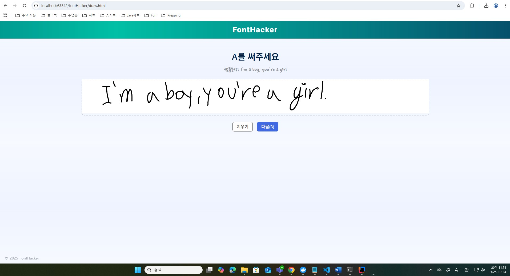
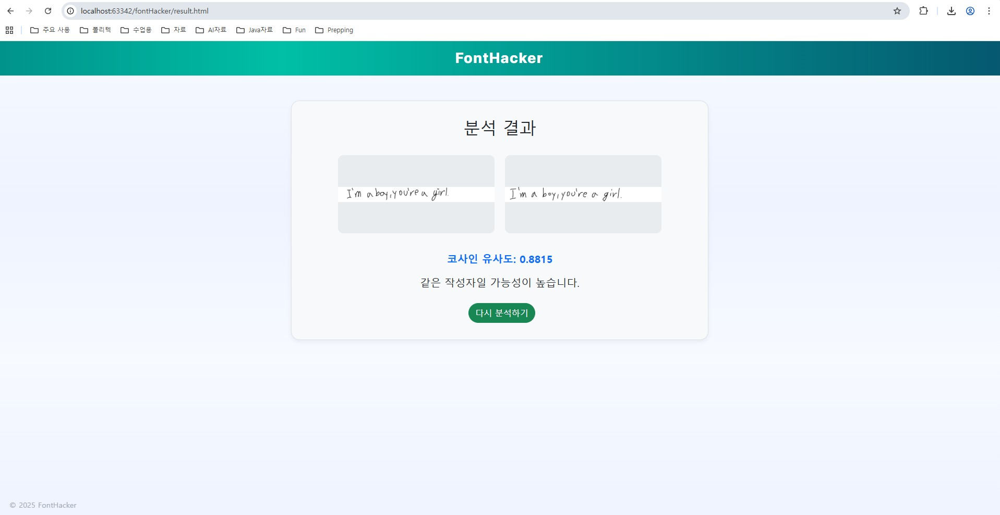
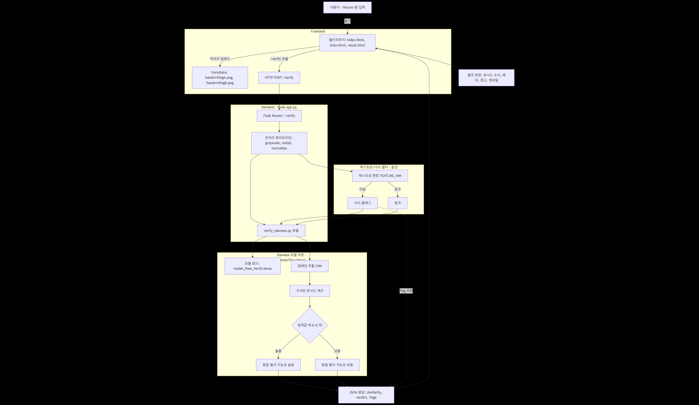

# FontHacker

CNN 기반 손글씨 특징 추출과 유사도 비교를 통해  
필기체를 분석·검증하는 웹 애플리케이션입니다.

---

## 1. 프로젝트 개요

FontHacker는 단순한 손글씨 문자 인식을 넘어,  
**작성자의 필기 습관 유사도를 비교·검증**하는 것을 목표로 한 프로젝트입니다.  

실제 사용자가 입력하는 손글씨 데이터의 불안정성과 품질 편차를 고려하여  
AI 모델뿐만 아니라 **전처리 및 시스템 구조 설계**에 중점을 두었습니다.

---

## 2. 프로젝트 배경 및 문제 정의

- 사용자 손글씨 입력은 크기, 기울기, 획 굵기 등 편차가 큼
- 단순 CNN 분류 모델은 실사용 환경에서 한계 존재
- 입력 데이터 품질에 따라 결과 신뢰도가 크게 달라짐

→ **“실제 서비스 환경에서도 동작 가능한 손글씨 분석 시스템”이 필요하다고 판단**

---

## 3. 해결 방법 및 접근 방식

### (1) 입력 데이터 전처리 및 품질 검증
- 손글씨 이미지 크기 및 위치 정규화
- 입력 품질이 낮은 경우 사전 필터링

### (2) Siamese CNN 구조 적용
- 두 손글씨 이미지를 동시에 입력
- 특징 벡터 추출 후 코사인 유사도 계산
- 단순 분류가 아닌 **유사도 기반 비교 방식** 채택

### (3) 웹 애플리케이션 연동
- Flask 기반 서버 구성
- 사용자가 직접 손글씨를 입력하고 결과를 확인할 수 있는 UI 제공

---

## 4. 시스템 흐름
### 📌 사용자 입력 화면 예시

아래는 사용자가 직접 손글씨를 입력하는 웹 UI 화면입니다.
사용자는 이 입력창에 손글씨로 문자를 입력한 후 분석 결과를 확인할 수 있습니다.

### 📌 분석 결과 예시

아래는 손글씨 입력 후 모델이 산출한 유사도 / 특징 비교 결과 화면입니다.
모델은 Siamese CNN을 기반으로 입력 이미지 간의 특징 벡터 유사도를 계산하여 결과를 제공합니다.

### 📌 시스템 구조 다이어그램

아래는 FontHacker의 전체 파이프라인 흐름을 시각화한 구조입니다.
사용자 입력 → 전처리 → CNN 특징 추출 → 유사도 계산 → 결과 출력까지
각 단계가 어떻게 연결되는지 보여줍니다.

---

## 5. 사용 기술

- **Language**: Python  
- **Deep Learning**: TensorFlow / Keras  
- **Image Processing**: OpenCV, NumPy  
- **Backend**: Flask  
- **Deployment**: Docker  
- **Frontend**: HTML / CSS / JavaScript  

---

## 6. 담당 역할

- 프로젝트 기획 및 팀장
- 전체 시스템 구조 설계
- CNN 모델 및 전처리 로직 구현
- 웹 연동 및 통합 테스트

---

## 7. 프로젝트를 통해 배운 점

- 데이터 품질이 AI 성능에 미치는 영향
- 모델 성능뿐 아니라 **시스템 설계의 중요성**
- 실제 사용자 환경을 고려한 문제 해결 경험

